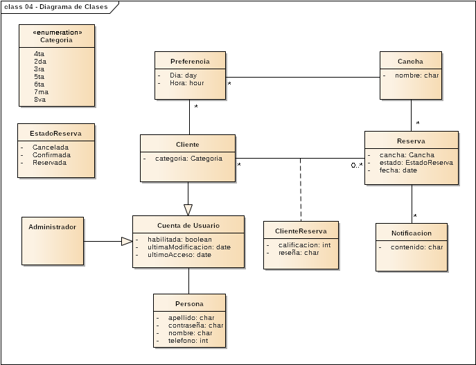

<div align="center">


# Boulevard 81

</div>

## Proyecto Seminario - Grupo 5

**Descripcion:** Boulevard 81 es un complejo deportivo de la cuidad de La Plata que actualmente maneja el core de su sistema manualmente con un administrador. El complejo deportivo alquila canchas de paddel para entrenamientos rutinarios y para clientes esporadicos ademas de realizar torneos de padel. El resultado de los torneos de padel tambien son compartidos manualmente mediante una hoja de calcula excel compartida.

**Objetivo:** Ofrecer una solucion web que: 

+ Centralizará el proceso de reserva de canchas (son diferentes y los consumidores son exigentes)

+ Login de los clientes

+ Sistema de matcheo de parejas basado en su historial deportivo y preferencias

---

<details>
<summary>Backend (clic para expandir)</summary>

## Backend

```bash
sudo apt update
sudo apt install python3-pip
```

```bash
cd backend/FastAPI/
```

```bash
python3 -m venv .venv && source .venv/bin/activate
´´´´version para windows ##revisar que parece que no conecta correctamente
python -m venv .venv && .venv\Scripts\activate 
```

Descargar algunas dependencias

```bash
pip install -r requirements.txt
```

Ejecutar el servidor

```bash
uvicorn main:app --reload
```

</details>

<details>
<summary>Frontend (clic para expandir)</summary>

## Frontend

Instalar [Node.js](https://nodejs.org/es/download)

```bash
cd frontend
```

```bash
npm install

```

```bash
npm run dev
```
</details>

<details>
<summary>Tema de las branch (clic para expandir)</summary>

## Tema de las branch

Antes de hacer un commit a main con todos los cambios y funcionalidades hechas, podemos trabajar en las ramas o branches.

En este repositorio esta la rama develop (backend) y la rama frontend (frontend).

Si quiero trabajar en la rama frontend que tengo que hacer?

```bash
git switch frontend
```

Haces los cambios. Luego:

```bash
git add . && git commit -m "Actualizar README.md" && git push origin frontend
```

Vas a GitHub y hacés clic en las ramas y le das a Crear pull request (PR) para fusionarla con main.

¿Que pasa si un compañero hizo un commit y por lo tanto, tengo una version "vieja" del codigo?

En ese caso, nos tenemos que traer lo nuevo del repo:

```bash
git fetch --all && git pull
```

=======
Tu repo local es como una copia del repositorio remoto. Si un compañero sube cambios (`git push`), esos commits **no se reflejan automáticamente** en tu repo local. Entonces:

- Tu copia del código está desactualizada.
- No ves los nuevos commits hasta que **sincronizás** con el remoto.

---

## ¿Cómo me traigo lo nuevo del repo?

Primero, necesitás traer los últimos cambios del servidor. Para eso se usa:

```bash
git fetch --all
```

Esto **descarga** toda la información nueva (commits, ramas, etc) **pero no modifica tu código actual ni cambia la rama en la que estás trabajando**.

> Es como preguntar "¿Qué hay de nuevo?" sin tocar nada todavía.

---

## ¿Cómo aplico esos cambios en mi código?

Si querés **actualizar tu rama actual con los nuevos cambios**, podés hacer:

```bash
git pull --rebase
```

Esto hace dos cosas:
1. **`fetch`**: Se trae los cambios nuevos desde el repo remoto.
2. **`rebase`**: Coloca tus cambios *encima* de los nuevos commits del remoto.

---

## ¿Por qué usar `--rebase`?

Porque `--rebase`:

- Mantiene el historial **más limpio** (sin merges innecesarios).
- Evita commits como `Merge branch 'main' of origin...`.

Ejemplo práctico:

Supongamos:
- Tu rama local `main` tiene un commit `A`.
- En el remoto, alguien ya subió `B` y `C`.

Cuando hacés:

```bash
git pull --rebase
```

Git va a:

1. Traer `B` y `C`.
2. "Quitar" temporalmente tu `A`.
3. Aplicar `B` y `C`.
4. Luego "volver a poner" tu `A`, pero ahora encima de `C`.

Entonces el orden final será: `B -> C -> A`.

Para ver las ramas del proyecto pueden ejecutar:

```bash
git branch
```
```

### Volver un commit atras

Si en un commit cometemos algun error o simplemente lo queremos borrar los cambios aplicados, podemos hacer esto:

```bash
git log
```

Para obtener el HASH del commit que queremos eliminar, y luego:

```bash
git reverse HASH
```
Una vez hecho esto, los cambios hechos se revertiran.

</details>

# Roadmap

* Logueo de usuarios y admin
   * [x] Login
   * [x] Register
   * [x] Gestionar Usuarios
   * [x] Que me autocomplete la contraseña cuando selecciono el nombre de usuario
   * [x] Una vez que el token expira y nos volvemos a conectar, desloguarnos automaticamente
   * [x] Setear el mail en cada usuario (borrar el telefono bd/back/front)
* Reserva de canchas
  * [x] Crear la entidad Reserva
  * [x] Implementar la logica en el backend
  * [x] Implementar el frontend de la reserva
  * [x] Preguntar por confirmacion de cancha
  * [x] Cancelar Reserva (No se borran, cambian de estado)
  * [x] Implementar logica para poder reservar con un rango de 1 semana
  * [x] Implemnetar logica para que solo se puedan ver las reservas del futuro, no del pasado
  * [x] Al momento de cancelar una reserva, se deria liberar la reserva para ese dia :o
  * [x] Setear limite de reservas x usuario
* ABML de Preferencias del usuario
  * [x] Crear la entidad Preferencia
  * [x] Implementar la logica en el backend
  * [x] Implementar el frontend de la reserva
  * [x] Setear limites para que no nos hagan goma la app
  * [x] Modificar preferencia
  * [x] Eliminar preferencia
* Sistema de matcheo de jugadores (Marcos)
  * [x] Crear la entidad Matcheo
  * [x] Implementar la logica en el backend
  * [x] Implementar el frontend respectivo
* Modulo del Admin (Mateo)
  * [x] Listar Usuarios (de a 10) y luego permitir modificarlo
  * [x] Buscar Usuario por nombre de usuario para gestionar usuario
  * [x] Alta de un cliente
* Frontend General (Nico)
  * [x] Hacer el Navbar
  * [x] Footer con links importantes
  * [x] Cambiar los alert por toast
* Notificaciones por mail
  * [x] Validar email del usuario
  * [x] Implemnetar estructura de la BD
  * [ ] Notificar posible matcheo a posibles usuarios.
* Home (javi)
  * [x] Fletar "¡Regístrate o inicia sesión para comenzar!" cuando estamos logueados
  * [x] Hacer que las imagenes vayan pasando solas cada x tiempo (mantener la posibilidad de pasarlas a mano)
  * [x] Solucionar Login y register duplicados, al momento de ingresar al home (no logueado)
* DevOps - CI/CD
  * [x] Actualizar el repo cada 1 hora y prepararlo ante posible cambios de dependencias
* Modulo de canchas (gestionado por el admin)
  * [x] Modelar la BD 
  * [x] Implementar el backend para el ABML
  * [x] Implemnetar el frontend
  * [x] Arreglar cualquier conflicto
* Seguridad
  * [ ] Asegurarse de la autenticacion en cada endpoint
  * [ ] Asegurarnos que las contraseñas cumplan cierto criterio de longitud y caracteres

## Diagrama de clases

<div align="center">



</div>

Cualquier modificacion que quieran hacerle al diagrama de clases podran hacerlo modificando el archivo .eap presente en el drive compartido entre nosotros.
