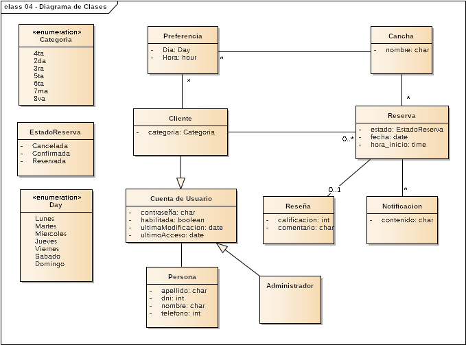

# Proyecto Seminario - Grupo 5

**Empresa:** Boulevard 81

**Descripcion:** Boulevard 81 es un complejo deportivo de la cuidad de La Plata que actualmente maneja el core de su sistema manualmente con un administrador. El complejo deportivo alquila canchas de paddel para entrenamientos rutinarios y para clientes esporadicos ademas de realizar torneos de padel. El resultado de los torneos de padel tambien son compartidos manualmente mediante una hoja de calcula excel compartida.

**Objetivo:** Ofrecer una solucion web que: 

+ Centralizará el proceso de reserva de canchas (son diferentes y los consumidores son exigentes).

+ Login de los clientes.

+ Sistema de matcheo de parejas basado en su historial deportivo y preferencias.

## Backend

```bash
sudo apt update
sudo apt install python3-pip
```

```bash
cd backend/FastAPI/
```

```bash
python3 -m venv .venv && source .venv/bin/activate
```

Descargar algunas dependencias

```bash
pip install uvicorn && pip install "fastapi[all]" && pip install python-jose && pip install passlib && pip install pymongo && pip install pytz
```

Ejecutar el servidor

```bash
uvicorn main:app --reload
```

## Frontend

Instalar [Node.js](https://nodejs.org/es/download)

```bash
cd frontend
```

```bash
npm install react-router-dom
```

```bash
npm run dev
```

<details>
<summary>Guía de Git y Flujo de Trabajo (clic para expandir)</summary>

## Tema de las branch

Antes de hacer un commit a main con todos los cambios y funcionalidades hechas, podemos trabajar en las ramas o branches.

En este repositorio esta la rama develop (backend) y la rama frontend (frontend).

Si quiero trabajar en la rama frontend que tengo que hacer?

```bash
git switch frontend
```

Haces los cambios. Luego:

```bash
git add . && git commit -m "Actualizar README.md" && git push origin frontend
```

Vas a GitHub y hacés clic en las ramas y le das a Crear pull request (PR) para fusionarla con main.

¿Que pasa si un compañero hizo un commit y por lo tanto, tengo una version "vieja" del codigo?

En ese caso, nos tenemos que traer lo nuevo del repo:

```bash
git fetch --all && git pull
```

=======
Tu repo local es como una copia del repositorio remoto. Si un compañero sube cambios (`git push`), esos commits **no se reflejan automáticamente** en tu repo local. Entonces:

- Tu copia del código está desactualizada.
- No ves los nuevos commits hasta que **sincronizás** con el remoto.

---

## ¿Cómo me traigo lo nuevo del repo?

Primero, necesitás traer los últimos cambios del servidor. Para eso se usa:

```bash
git fetch --all
```

Esto **descarga** toda la información nueva (commits, ramas, etc) **pero no modifica tu código actual ni cambia la rama en la que estás trabajando**.

> Es como preguntar "¿Qué hay de nuevo?" sin tocar nada todavía.

---

## ¿Cómo aplico esos cambios en mi código?

Si querés **actualizar tu rama actual con los nuevos cambios**, podés hacer:

```bash
git pull --rebase
```

Esto hace dos cosas:
1. **`fetch`**: Se trae los cambios nuevos desde el repo remoto.
2. **`rebase`**: Coloca tus cambios *encima* de los nuevos commits del remoto.

---

## ¿Por qué usar `--rebase`?

Porque `--rebase`:

- Mantiene el historial **más limpio** (sin merges innecesarios).
- Evita commits como `Merge branch 'main' of origin...`.

Ejemplo práctico:

Supongamos:
- Tu rama local `main` tiene un commit `A`.
- En el remoto, alguien ya subió `B` y `C`.

Cuando hacés:

```bash
git pull --rebase
```

Git va a:

1. Traer `B` y `C`.
2. "Quitar" temporalmente tu `A`.
3. Aplicar `B` y `C`.
4. Luego "volver a poner" tu `A`, pero ahora encima de `C`.

Entonces el orden final será: `B -> C -> A`.

Para ver las ramas del proyecto pueden ejecutar:

```bash
git branch
```
```

### Volver un commit atras

Si en un commit cometemos algun error o simplemente lo queremos borrar los cambios aplicados, podemos hacer esto:

```bash
git log
```

Para obtener el HASH del commit que queremos eliminar, y luego:

```bash
git reverse HASH
```

## Diagrama de clases



Cualquier modificacion que quieran hacerle al diagrama de clases podran hacerlo modificando el archivo .eap presente en el drive compartido entre nosotros.