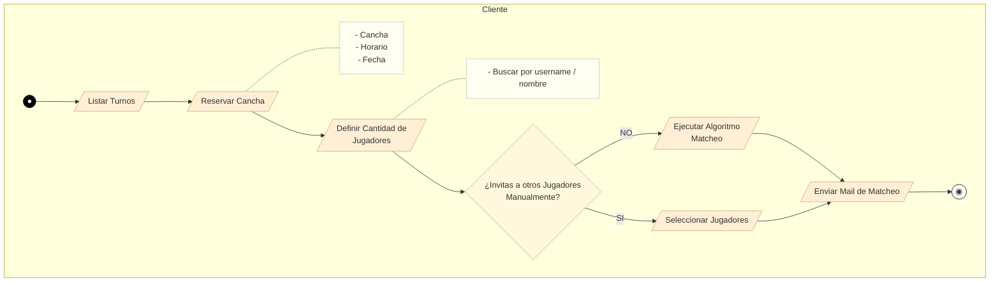

# Workflow de Matcheo - Cliente

Link al [video](https://youtu.be/V-lUZKgtTCo) en YT.

Este diagrama representa el flujo de actividades del cliente para reservar una cancha y realizar el matcheo de jugadores.

## Descripción del Flujo

1. **Listar Turnos**: El cliente visualiza los turnos disponibles
2. **Reservar Cancha**: Selecciona cancha, horario y fecha
3. **Definir Cantidad de Jugadores**: Establece cuántos jugadores necesita
4. **Decisión de Matcheo**:
   - **SI** (manual): Busca y selecciona jugadores por username/nombre
   - **NO** (automático): Ejecuta el algoritmo de matcheo
5. **Enviar Mail de Matcheo**: Notifica a los jugadores seleccionados
